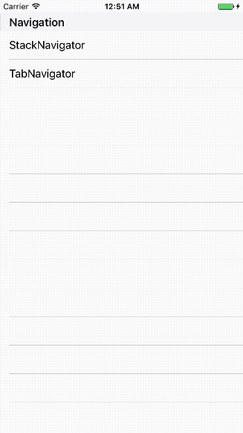

# StackNavigation

Provides a way for your app to transition between screens where each new screen is placed on top of a stack.


## Sample



#### how to open
```js
function openStackNavigator() {
  const { StackNavigator } = Alloy.createWidget('titanium.navigation');
  const StackWindow = StackNavigator({
    Main: { controller: 'stack/main' },
    Profile: { controller: 'stack/profile' },
  }, {
    initialRouteName: 'Main',
    initialRouteParams: { isCloseable: true }
  });
  StackWindow.open();
}
```

#### how to set
```js
// controllers/stack/main.js
const CONFIG = arguments[0] || {};

function navigateProfile() {
  const { navigate } = CONFIG.navigation;
  navigate('Profile');
}

exports.navigationOptions = {
  window: {
    title: 'Main'
  },
  navBar: {
    title: 'Main'
  }
};
```


## API Definition

### StackNavigator
```js
StackNavigator(ScreenConfigs, StackNavigatorConfig)
```

#### ScreenConfigs

Options for the screen:

- `key`: Screen Name for navigation
- `key.controller`: Alloy controller path
- `key.options`: The params to be injected into the controller

#### StackNavigatorConfig

Options for the navigation:

- `initialRouteName`: Sets the default screen of the stack.
- `initialRouteParams `: The params to be injected into the initial controller
	- `isCloseable`: Closeable navigation

### Controller side
```js
exports.navigationOptions = { window, navBar }
```

#### window

Properties for window : [Ti.UI.Window](http://docs.appcelerator.com/platform/latest/#!/api/Titanium.UI.Window)

#### navBar - iOS

Properties for navigation (ios)

- `title`: Title for navBar

#### navBar - Android

Properties for [Titanium.Android.ActionBar](http://docs.appcelerator.com/platform/latest/#!/api/Titanium.Android.ActionBar)


## Examples

See the examples [index.js](https://github.com/gimdongwoo/titanium-navigation/blob/master/sample/app/controllers/index.js) and [stack folder](https://github.com/gimdongwoo/titanium-navigation/tree/master/sample/app/controllers/stack).
