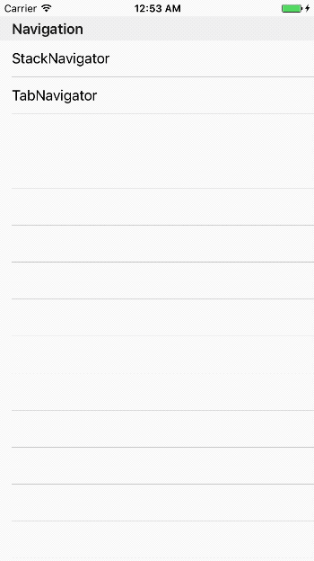

# TabNavigation

Used to easily set up a screen with several tabs with a TabBar.


## Sample



#### how to open
```js
function openTabNavigator() {
  const { TabNavigator } = Alloy.createWidget('titanium.navigation');
  const TabWindow = TabNavigator({
    Tab1: { controller: 'tab/tab1' },
    Tab2: { controller: 'tab/tab2' },
    Tab3: { controller: 'tab/tab3' },
  }, {
    initialRouteName: 'Tab1',
    initialRouteParams: { isCloseable: true }
  });
  TabWindow.open();
}
```

#### how to set
```js
// controllers/tab/tab1.js
const CONFIG = arguments[0] || {};

function navigateTab2() {
  const { navigate } = CONFIG.navigation;
  navigate('Tab2');
}

exports.navigationOptions = {
  window: {
    title: 'Tab1'
  },
  navBar: {
    title: 'Tab1'
  },
  tab: {
    title: 'Tab1',
    icon: '/images/tap_nav_newsfeed_selected.png',
  }
};
```


## API Definition

### TabNavigator
```js
TabNavigator(ScreenConfigs, TabNavigatorConfig)
```

#### ScreenConfigs

Options for the screen:

- `key`: Screen Name for navigation
- `key.controller`: Alloy controller path
- `key.options`: The params to be injected into the controller

#### StackNavigatorConfig

Options for the navigation:

- `initialRouteName`: Sets the default screen of the tab.
- `initialRouteParams `: The params to be injected into the initial controller
	- `isCloseable`: Closeable navigation

### Controller side
```js
exports.navigationOptions = { window, navBar, tab }
```

#### window

Properties for window : [Ti.UI.Window](http://docs.appcelerator.com/platform/latest/#!/api/Titanium.UI.Window)

#### navBar - iOS

Properties for navigation (ios)

- `title`: Title for navBar

#### navBar - Android

Properties for [Titanium.Android.ActionBar](http://docs.appcelerator.com/platform/latest/#!/api/Titanium.Android.ActionBar)

#### tab

Properties for tabbar : [Titanium.UI.Tab](http://docs.appcelerator.com/platform/latest/#!/api/Titanium.UI.Tab)


## Examples

See the examples [index.js](https://github.com/gimdongwoo/titanium-navigation/blob/master/sample/app/controllers/index.js) and [tab folder](https://github.com/gimdongwoo/titanium-navigation/tree/master/sample/app/controllers/tab).
